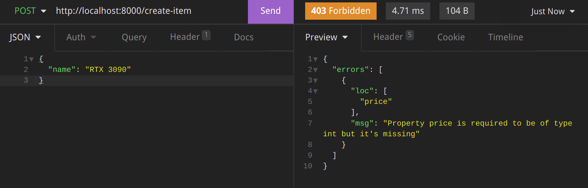
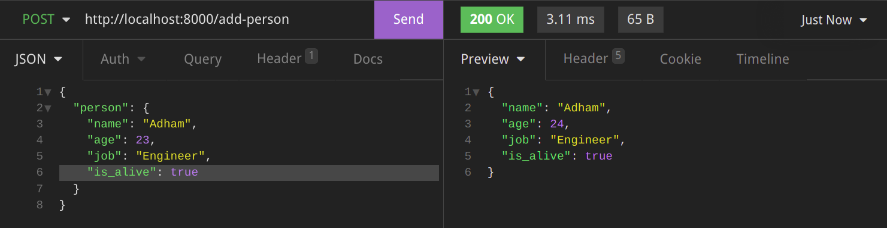
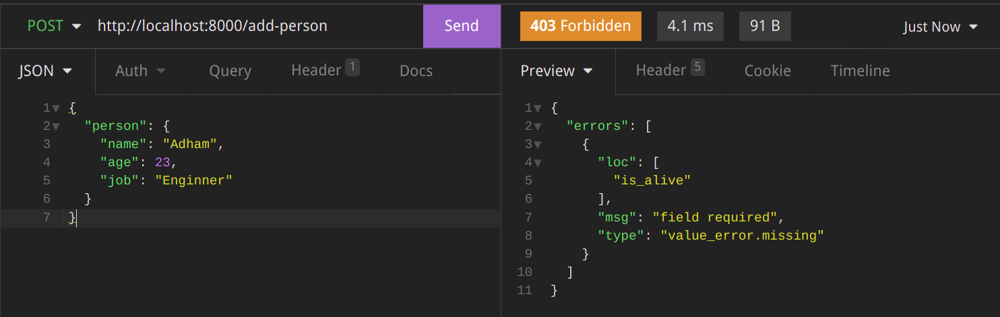

# Automatic Validation

### A simple example

```python
from simpleapi import SimpleAPI

app = SimpleAPI()

@app.post("/create-item")
def create_item(name: str, price: int):
    return {"name": name, "price": price}
```

Here we specified that the request body will have a field called "name" and its type will be a string, and a field called "price" and its type will be an integer.

Open Postman or Insomnia (or any HTTP client you like) and send a post request to `http://localhost:8000/create-item` with the required porperties:


### Not Sending Required Properties

So, that worked, but what happens if the request body doesn't match the arguments you specified?

Lets remove the price field from the request body and send the request again and see what will happen:



SimpleAPI automatically validated the request body and returned an error response specifying that the request body didn't match the required arguments. In particular, the "price" field is missing.

### Sending Wrong Type of Required Fields

If you add the "price" field back, and make its value anything but an integer, SimpleAPI will return an error response specifying that the "price" field's value isn't of the required type.

An example:


### Pydantic Models

You can have more fine-grained control and specify objects using Pydantic BaseModels.

An example:

```python
from simpleapi import SimpleAPI
from pydantic import BaseModel

class Person(BaseModel):
    name: str
    age: int
    job: str
    is_alive: bool

app = SimpleAPI()

@app.post("/add-person")
def add_person(person: Person):
    person.age += 1
    return person
```



If we for example removed the "is_alive" field, the automatic validation will handle it for us.


