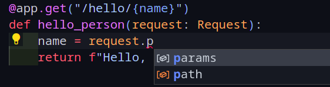
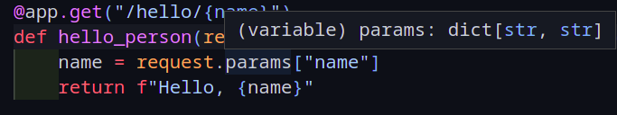

# Features

### Simple and easy.

SimpleAPI is a small framework with a small codebase, because of its simplicity, it's easy to use, and easy to understand.

You can take a look at the source code to have a deeper look at what's going on

### Fully Typed.

I was hugely inspired by FastAPI's use of [Python's type annotations](https://docs.python.org/3/library/typing.html), it simply makes the developing experience so much easier because of the help from the IDE/Code Editor.

### Automatic Validation

If you specify the required fields of the incoming request body and their types, SimpleAPI automatically validates the incoming request body and supplies your functions with the required arguments.

If the request body doesn't contain the arguments you specified, or doesn't match the types you specified, SimpleAPI returns an error response with a message highlighting where the error occured and what is the cause.

You can have more fine-grained control over your arguments if you use [Pydantic](https://pydantic-docs.helpmanual.io). SimpleAPI will also validate the request body and return an error if it doesn't match your specified Pydantic models.

### Tested

There are over 27 tests for several parts of functionalities that SimpleAPI provides.
