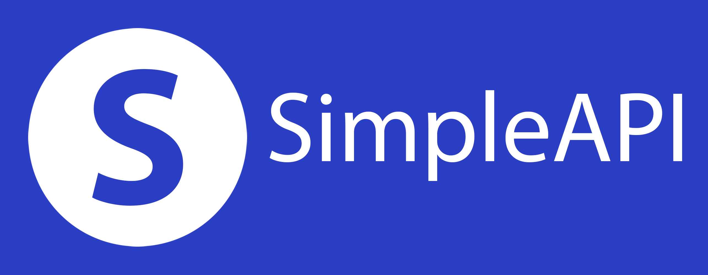

# SimpleAPI

SimpleAPI is a minimalistic, unopinionated, WSGI-compliant, microframework for Python, inspired by FastAPI & Flask.

Source Code: [https://github.com/adhamsalama/simpleapi](https://github.com/adhamsalama/simpleapi)

---

The features:

1. Simple and easy to understand.
1. Fully Typed.
1. Automatic Validation.
1. Tested.

The drawbacks:

1. Not battle-tested.
1. No websockets support (yet!).
1. Doesn't support async/await like FastAPI.

---

## Installation

`pip install simplestapi`

Note that here it's "simplestapi" instead of "simpleapi". This is because the name "simpleapi" is already taken.

You will also need to install [gunicorn](https://gunicorn.org) to run the application.

`pip install gunicorn`

---

## Note

SimpleAPI is made only for educational purposes, I have been using Python frameworks like Flask and Django for years, and most recently, FastAPI. I was inspired by FastAPI and decided to create a framework by myself to deepen my knowledge of how web frameworks work.

That being said...

